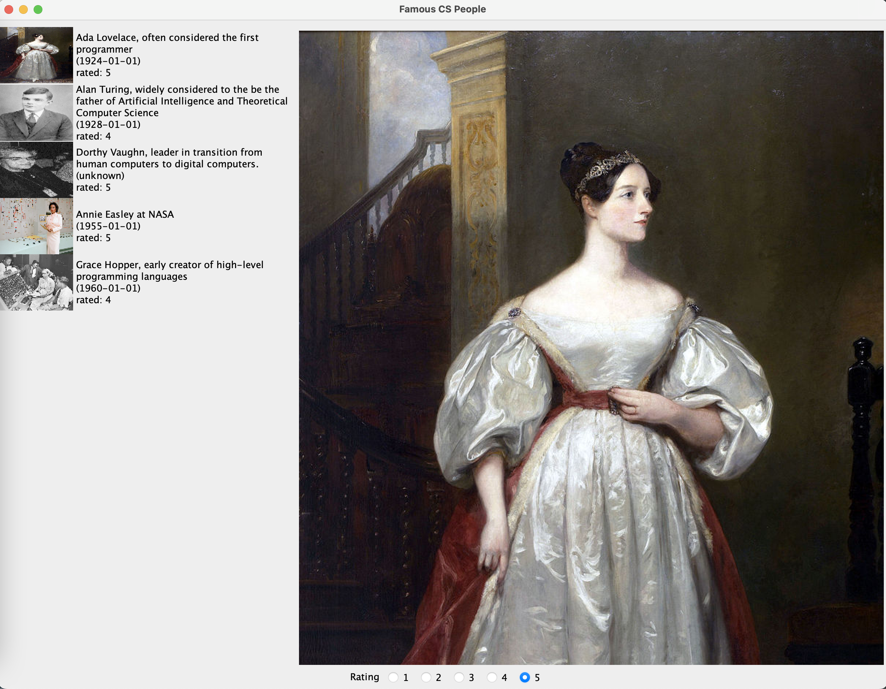

More Graphical User Interfaces

This lab is a continuation of our photo library java GUI application.


## Learning Objectives

- Experience Event Driven Programming
- Implement a Menu and handle menu events
- Design and work with a Graphical User Interface using Swing

## General Overview

In this lab we will work with code that deploys a graphical user interface (GUI) to add keyboard event handling and a Menu to help modernize the user interface.

## TODO 0:

Clone this repository and open it in IntelliJ on your local computer.

## TODO 1: Replace the Buttons

Get rid of the buttons for previous, next, rating sort and date sort.

  - [ ] The buttons are declared as instance fields but then instantiated and used in a few spots throughout the PhotoViewer class. You can remove all references to them but leave the `NavigationListener` skeleton for now.



## TODO 2: Add a KeyListener

We still want to be able to navigate through the  advancement through the images using the keyboard arrow keys. Right arrow for next and left arrow for previous. This will free up screen real-estate for displaying photos.

At the moment the `NavigationListener` handles button clicks (it implements `ActionListener`) alter it so that it implements `KeyListener`.

You can remove the `ActionListener` Methods and implement the `KeyListener` Methods. Ensure the keyPressed method works properly.

Note: `if (e.getKeyCode() == KeyEvent.VK_RIGHT )` the previous code will check if a right arrow key has been pressed (`KeyEvent.VK_LEFT` for the left arrow key). The code inside `keyPressed` will similar to the previous action listener (aside from checking for the arrow keys.)

Lastly, tell the `imageDisplayLabel` to listen for key presses. Find the `imageDisplayLabel` and add the following line:
`imageDisplayLabel.addKeyListener(new NavigationListener())` (or reuse the existing `NavigationListener` object) to the object and set the Object as focusable: `imageDisplayLabel.setFocusable(true)`

Note: KeyListeners need the focus to be able to listen to events.

**Run the program** and see what happens when use the arrows and then see what happens when you click the Rating options and then use the arrows again. You can use `<TAB>` to change the focus to other components of the GUI if necessary.

# TODO 3: Add Menu Options to replace the sorts

- [ ] Add two instance fields to the `PhotoViewer` class:
```java
  private JMenuItem dateSortMenuItem;
  private JMenuItem ratingSortMenuItem;
```

- [ ] Add method  `public JMenuBar createMenu()`
The code of createMenu looks like this:

```java
/**
Create the menubar
@return a menubar to be sent into setJMenuBar method
**/
public JMenuBar createMenu() {

        JMenuBar menuBar;
        JMenu menu;

        //Create the menu bar.
        menuBar = new JMenuBar();

        //Build the menu.
        menu = new JMenu("Sort");
        menu.setMnemonic(KeyEvent.VK_S);
        menu.getAccessibleContext().setAccessibleDescription(
                "Sort the photographs");
        menuBar.add(menu);


        dateSortMenuItem = new JMenuItem("Sort By Date", KeyEvent.VK_D);
        ratingSortMenuItem = new JMenuItem("Sort By Rating", KeyEvent.VK_R);

        menu.add(dateSortMenuItem);
        menu.add(ratingSortMenuItem);
        return menuBar;
    }
```


Now in the initialize method (near the bottom) call the following:

`setJMenuBar(createMenu());`

and then tell the program to listen for menu actions:

`dateSortMenuItem.addActionListener(sortListener);`
`ratingSortMenuItem.addActionListener(sortListener);`

Run the program and try the menu. Notice that the sorts don't yet work.

Go to the `SortNavigationListener` inner class and ensure if the source is `dateSortMenuItem` or `ratingSortMenuItem` those events are handled correctly.

**rerun the program** and verify the menu is working.


# TODO 3: Improve the Thumbnails

You may notice the thumbnails are directly scaled to 102 x 77 pixels. This ruins the aspect ratio of the photos. Also that unsightly text is crowding our photospace. We will fix the image scaling and then add a mouse over for the text (caption, etc) to appear.

Hidding the text until a mouse-over is simple:

In the `drawThumbnails` method move the existing text for thumbnails:
`"<html><body width='300'>"
                    + p.getCaption() + "<br>(" + p.getDateTaken() + ")<br>"
                    + "rated: " + p.getRating() + "</body></html>"`

 into a setToolTipText call:

 ```java
 thumbnailLabel.setToolTipText("<html><body width='300'>"
                     + p.getCaption() + "<br>(" + p.getDateTaken() + ")<br>"
                     + "rated: " + p.getRating() + "</body></html>");
 ```

rerun the program and verify the caption is available via mouse over.

Scaling the thumbnails is a bit more complicated

You can retrieve the width and height from a `BufferedImage` using `.getWidth()` and `.getHeight()` and you can scale a BufferedImage using:

`.getScaledInstance(width, height, Image.SCALE_FAST )`

If either of the width and height are -1 in getScaledInstance then the ratio is preserved. See what happens if you set the width to 102 but the height to -1 when scaling the images.

BufferedImage also has a .getSubimage(x,y,width, height) method that cuts an image according to the parameters provided (x,y is the top left of the new cut image with width and height dimensions ).

Using the above methods try to produce *visually appealing* thumbnails of uniform size (102x77).

## TODO 4: Explore and experiment

Please take a few moments to read the code further and generate one question that you might try to find the answer to today.

Example question: What happens if you change the BoxLayout that aligns the icons to use a the X_AXIS for alignment:
`iconLayout = new BoxLayout(thumbnailPanel, BoxLayout.X_AXIS);`

as opposed to the its current `Y_AXIS` alignment?


**End of lab**
